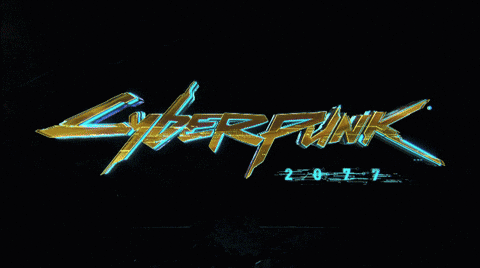
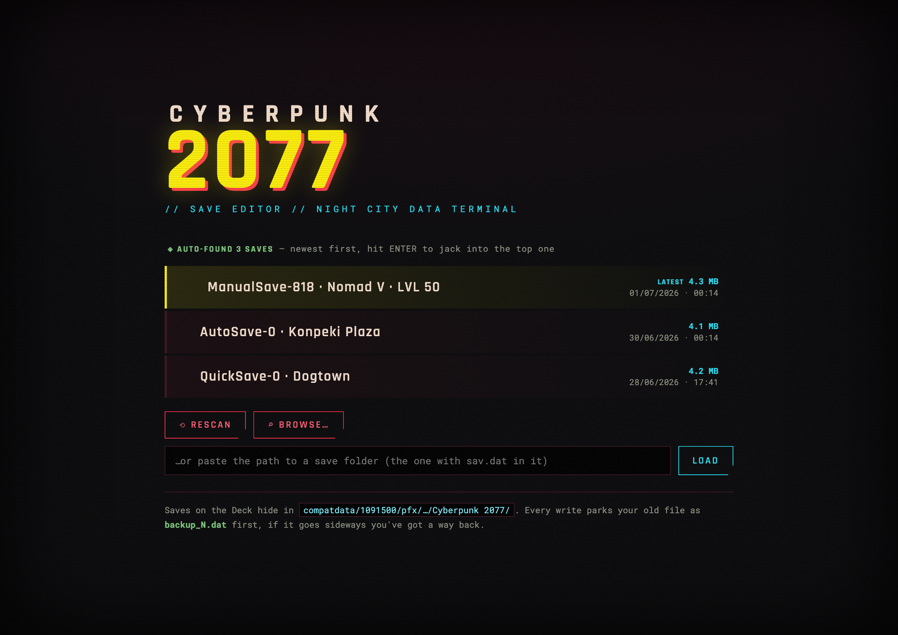
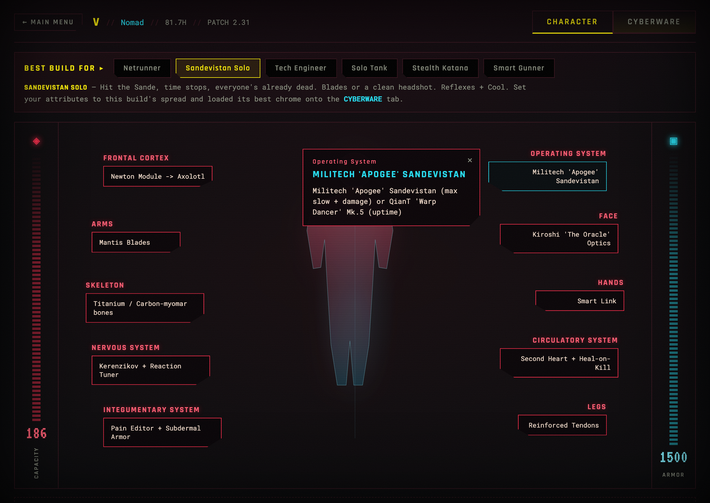
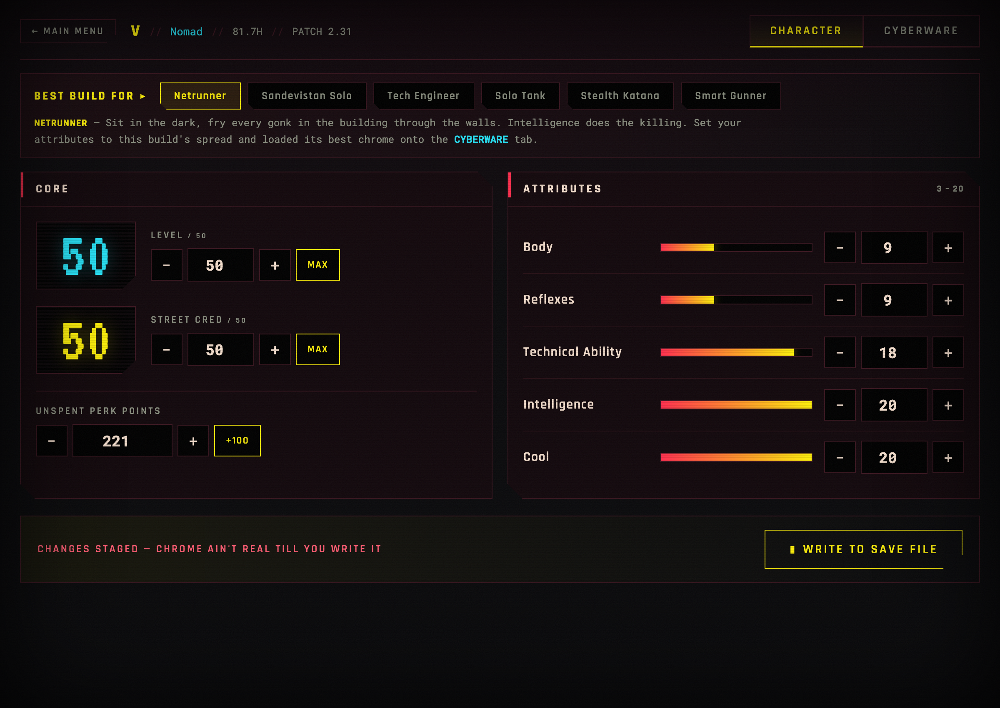

<div align="center">



# Night City Save Editor

**A Cyberpunk 2077 save editor built for the Steam Deck.**

Laid out like the actual in-game menus. Round-trips your save byte for byte and
backs it up before it writes a single thing. Pick a save, pick a build, done.


</div>

---

<div align="center">

</div>

One click sets your attributes, level and street cred, then drops the
best-in-slot chrome for that playstyle onto a proper in-game cyberware screen.

<div align="center">

</div>

## What it edits

All of this lives in the player development data, the safest part of the save to
touch. Every value is written in place at the same byte length, so the save
structure never shifts.

- Character level (1 to 50)
- Street cred (1 to 50)
- The five attributes: Body, Reflexes, Technical Ability, Intelligence, Cool (3 to 20, the game's real cap)
- Unspent perk points
- Build presets that set all of the above in one click

<div align="center">

</div>

## Build presets

Six of the popular archetypes. Each sets the attribute spread and shows you the
best-in-slot cyberware for that build on the cyberware screen:

| Build | Plays like |
| --- | --- |
| **Netrunner** | Sit in the dark, fry every gonk through the walls. Intelligence does the killing. |
| **Sandevistan Solo** | Hit the Sande, time stops, everyone's already dead. Blades or a clean headshot. |
| **Tech Engineer** | Charge a tech shot through three walls and a skull. Chromed to the eyeballs. |
| **Solo Tank** | Walk through the gunfire, rip their arms off, go home. Big dumb Body bruiser. |
| **Stealth Katana** | One with the shadows, one swing one kill. Cool + Reflexes. |
| **Smart Gunner** | Let the bullets do the aiming. Curve rounds round cover. Tech + Cool. |

The cyberware list is a ripperdoc shopping list, not a magic button. It does not
inject items into the save, because the inventory format is where saves get
bricked. Buy and slot the chrome yourself in game.

## Running it

### Steam Deck (recommended)

Browser mode, no native GUI dependencies, the reliable path on SteamOS.

```bash
./run-deck.sh
```

Builds a small local venv on first run, starts a local server and opens the
editor in your browser. To get it into the app menu with its icon (then add it
to Steam as a non-Steam game), run once from Desktop Mode:

```bash
./install-deck.sh
```

### macOS / Linux desktop (native window)

```bash
./run.sh
```

Opens in its own window via pywebview.

## Where your saves are

On the Deck, Cyberpunk saves sit inside the Proton prefix:

```
~/.local/share/Steam/steamapps/compatdata/1091500/pfx/drive_c/users/steamuser/Saved Games/CD Projekt Red/Cyberpunk 2077/
```

The editor scans that automatically (internal storage and SD card), plus the
native Windows/GOG location and your Documents folder. If it cannot find them,
hit BROWSE or paste the path to the folder that has `sav.dat` in it.

## Safety

- Before every write, your current `sav.dat` is rotated to `backup_N.dat`. If a
  save goes bad, delete `sav.dat` and rename the newest backup back.
- The parser is verified to load and re-save a real patch 2.31 save with an
  identical checksum, so an untouched save is never altered.
- Attributes are clamped to the legitimate 3 to 20 range.
- Test an edited save before you rely on it, and edit with the game closed so
  Steam Cloud does not overwrite your changes.

## How it works

- `cp77edit/_container/` is the low-level save container (LZ4 chunk table and
  node tree), patched to accept the 512-entry chunk table that patch 2.31 uses.
- `cp77edit/editor.py` finds V's `PlayerDevelopmentData` node, walks the
  proficiency, attribute and dev-point arrays, and edits the integers in place.
- `cp77edit/builds.py` holds the presets and the cyberware reference.
- `app.py` is the native window, `server.py` is the browser/Deck mode. Both wrap
  the same editor and serve the same UI in `web/`.

## Compatibility

Built and verified against game version 2.31 (save version 269). The container
format is stable across the 2.x patches and the fields it edits have been in the
same place since 2.0, so it holds across the 2.x line. It keys off the save's own
version and will not force a write it does not understand.

---

<div align="center">

Not affiliated with CD Projekt Red. Back up your saves.

Save container based on the pure-Python CP77 tooling by
[fmwviormv](https://github.com/fmwviormv/CyberpunkPythonHacks).

</div>
